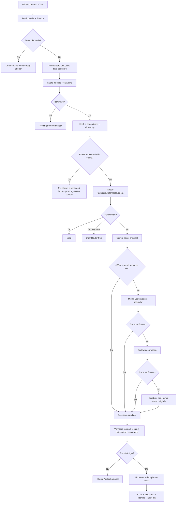

# Furnizori calificați și workflow recomandat pentru IZZ.ro

**Data cercetării:** 19 august 2026.  
**Regulă geografică:** Asia fără China, Europa și America.  
**Scop:** selectarea unei echipe multi-provider pentru agregare de știri în limba română, cu cost minim, calitate controlabilă și fallback rezilient.

## 1. Criterii de calificare

Un provider este considerat **calificat pentru acces** dacă are API public documentat, un plan gratuit sau credite gratuite verificabile și funcții compatibile cu pipeline-ul. Este considerat **calificat pentru nucleul editorial românesc** numai dacă trece și testele locale de factualitate, limbă română, JSON structurat, latență și stabilitate.

Acestea sunt două criterii diferite. Un provider poate fi gratuit și tehnic accesibil, dar nepotrivit ca editor român principal. În plus, planul gratuit poate fi o perioadă de trial, un credit unic sau un plafon care se schimbă în funcție de cont; nu trebuie tratat ca infrastructură nelimitată.

## 2. Furnizori calificați — lista actualizată

| Regiune | Provider și țară | Acces gratuit verificat | Funcții utile pentru IZZ.ro | Potrivire pentru română | Rol recomandat | Situația în cod |
|---|---|---|---|---|---|---|
| **America** | **Google Gemini — SUA** | Free tier cu acces limitat la modele, tokeni input/output gratuiți și Google AI Studio; limitele sunt per proiect și model, măsurate prin RPM/TPM/RPD [1][2] | Chat, multimodal, JSON Schema, extracție, clasificare, workflow agentic | **Foarte bun candidat**, dar trebuie măsurat pe corpusul IZZ.ro | Editor principal și judge pentru articole dificile | Provider existent |
| **America** | **Groq — SUA** | Free Plan cu limite pe model; documentația publică indică, de exemplu, 30 RPM, 1.000 RPD, 8K TPM și 200K TPD pentru anumite modele [3] | API rapid, chat, rate-limit headers, retry-after, modele open | Bun pentru română, dar necesită evaluare de stil și factualitate | Clasificare rapidă, prefiltrare, loturi și fallback | Adaptor OpenAI-compatible existent |
| **America** | **OpenRouter — SUA** | Modele cu sufix `:free`; 20 RPM; 50 cereri/zi fără credite sau 1.000/zi după cel puțin 10 USD credite; modelul ales poate varia [4][5][6] | API unificat, free router, structured outputs/tools/vision când modelul selectat le suportă, fallback upstream | Variabilă deoarece modelul liber se poate schimba | Laborator, fallback de dezvoltare și teste A/B | Adaptor existent |
| **America** | **Cerebras — SUA** | Free Trial: 5 RPM, 30K TPM, 1M TPH și 1M TPD pentru modelele listate; 5 USD credit, expiră în 30 zile după adăugarea unei metode de plată; **nu există tier permanent gratuit** [7] | Inferență foarte rapidă, chat OpenAI-compatible | Potrivit pentru prelucrare rapidă, dar trebuie verificat în română | Benchmark de latență și fallback temporar | Adaptor existent |
| **Europa** | **Mistral AI — Franța** | Free mode/API access documentat; limita exactă este dependentă de cont/model și trebuie citită din pagina de Limits [8] | Chat, JSON mode, JSON Schema/Pydantic structured outputs, batch/RAG/guardrailing în ecosistemul Studio [9][10] | **Foarte bun candidat european** pentru română; se validează empiric | Editor secundar, verifier și procesare structurată | Adaptor existent |
| **Europa** | **Scaleway Generative APIs — Franța** | 1.000.000 tokeni gratuiți pentru client nou; după prag se facturează per token; serverele serverless sunt în Paris [11][12] | OpenAI-compatible, chat, vision, embeddings, structured outputs, function calling, RAG și batches | Bun ca infrastructură europeană; calitatea depinde de modelul ales | Fallback european, staging și embeddings | Nu este încă în catalogul IZZ.ro actual |
| **Asia fără China** | **Sarvam AI — India** | 100 INR credit gratuit pentru utilizatorii noi; creditul nu expiră; limite Starter documentate, în general 60 req/min și 40 req/min pentru Sarvam-105B [13] | Chat 105B, traducere, STT, TTS, document intelligence, beta pentru modele open-source | **Nu este potrivit ca editor român principal**: modelele proprii sunt optimizate pentru 10–22 limbi indiene și engleză; româna nu este în lista oficială [14] | Specialist regional pentru hindi/engleză, nu nucleu IZZ.ro | Nu este integrat în catalogul actual |
| **Asia fără China** | **AI21 Labs / Jamba — Israel** | Credit de probă de 10 USD pentru cont nou, valabil 3 luni [15] | Chat API, SDK, playground; Jamba are context până la 256K și deployment privat | **Slab pentru româna editorială**: documentația enumeră 9 limbi oficiale fără română și avertizează asupra biasului predominant occidental/englez [16] | Verifier în engleză, documente lungi sau experiment; nu editor român | Nu este integrat |
| **Asia fără China** | **SEA-LION — Singapore** | Trial API key disponibil din Playground; documentația confirmă endpoint OpenAI-compatible, însă quota exactă trebuie verificată în contul API [17] | Chat, traducere, rezumare, function calling, SEA-Guard, embeddings | **Nu este candidat principal pentru română**: este antrenat pentru limbile și contextele Asiei de Sud-Est | Guard/specialist regional, test de diversitate, nu editor român | Nu este integrat |
| **Asia fără China** | **NAVER HyperCLOVA X / CLOVA Studio — Coreea de Sud** | API și test keys documentate, dar pagina oficială consultată nu confirmă o cotă gratuită numerică; prin urmare nu trece criteriul de free plan verificat [18] | Chat, streaming, structured outputs, function calling, RAG reasoning, reranker, embeddings, router | Probabil bun pentru coreeană; româna nu este documentată | Candidat ulterior, numai după confirmarea prețului și a accesului | Nu este integrat |

## 3. Furnizori analizați, dar excluși din nucleul gratuit

| Provider / zonă | Motivul excluderii din nucleul recomandat |
|---|---|
| **Sakana AI — Japonia** | Nu a fost identificat un API public general cu plan gratuit verificabil pentru generare editorială; este interesant de urmărit, dar nu poate fi declarat integrat sau calificat acum |
| **rinna — Japonia** | Nu a fost confirmat un plan API gratuit public și stabil pentru cazul IZZ.ro |
| **NAVER HyperCLOVA X** | API-ul există, dar free quota-ul nu a fost confirmat oficial în documentația consultată |
| **Cerebras** | Calificat pentru trial, nu pentru gratuitate permanentă |
| **AI21** | Calificat pentru trial, dar cu suport oficial de limbă insuficient pentru română |
| **Sarvam și SEA-LION** | Accesul este gratuit/trial, dar specializarea lingvistică este regională, nu română |
| **Providerii din China** | Excluși conform cerinței: Qwen, DeepSeek, GLM și alții nu intră în lista operațională, chiar dacă pot fi disponibili prin gateway-uri sau hosting european |

## 4. Formula optimă de echipă pentru IZZ.ro

Recomand o **cascadă cu roluri distincte**, nu o listă lungă în care toți providerii încearcă aceeași sarcină. Principiul este inspirat de FrugalGPT, RouteLLM și RouterBench: rutare după dificultate și cost, cascada doar când există un motiv, iar selecția trebuie calibrată pe rezultatele reale ale IZZ.ro [19][20][21].

| Rol | Provider recomandat | Ce face | De ce |
|---|---|---|---|
| **Control determinist** | Cod local IZZ.ro | Validare URL, sursă, dată, duplicat, carantină, schema finală | Nu consumă tokeni și nu depinde de AI |
| **Editor principal** | Gemini | Titlu, teaser, sinteză, categorie și entități în JSON Schema | Calitate generală și structured output documentat |
| **Editor european secundar** | Mistral | Produce sau reface articolele care nu trec guardurile | Diversifică erorile și oferă contract JSON puternic |
| **Worker rapid** | Groq | Prefiltrare, clasificare, dedup preliminar și loturi simple | Latență mică și free plan documentat |
| **Worker de viteză / benchmark** | Cerebras | Loturi simple sau test comparativ de latență | Foarte rapid, dar trial temporar |
| **Fallback european** | Scaleway cu un model eligibil | Continuitate și procesare sub hosting european | 1M tokeni inițiali, OpenAI-compatible și structured outputs |
| **Pool de experiment** | OpenRouter free | Compararea modelelor gratuite și fallback low-volume | Gratuit, dar modelul și disponibilitatea variază |
| **Guard de siguranță** | Validatoare locale; opțional SEA-Guard | Siguranță și clasificare | Guardurile locale trebuie să rămână autoritatea finală |
| **Fallback fără cost API** | Ollama local | Procesare de avarie sau articole amânate | Nu depinde de quota externă; calitatea depinde de model/local hardware |
| **Specialiști regionali** | Sarvam, SEA-LION, AI21 | Nu procesează implicit știri românești; se activează doar pentru taskuri compatibile | Free/trial, dar mismatch de limbă pentru nucleul IZZ.ro |

## 5. Ordinea operațională recomandată



## 6. Regula de decizie pentru router

Routerul nu trebuie să aleagă doar după provider disponibil. Pentru fiecare task calculează un scor operațional:

```text
score(provider, task) =
    quality_fit(task)
  - latency_penalty(task)
  - cost_penalty(task)
  - quota_risk(provider)
  - language_risk(provider, ro)
  - privacy_risk(provider)
```

La început, scorul poate fi configurat determinist. După acumularea unui corpus de articole acceptate și respinse, se poate antrena un router local pe datele IZZ.ro. Acest lucru urmează ideea RouteLLM: routerul trebuie calibrat pe preferințe și rezultate, nu pe presupuneri generale despre modele [20].

## 7. Contractul comun pentru toți providerii

Fiecare adaptor trebuie să transforme API-ul extern în același rezultat intern:

```json
{
  "request_id": "izz-2026-08-19-000123",
  "provider": "gemini",
  "model": "gemini-flash",
  "status": "success",
  "text": "...",
  "input_tokens": 0,
  "output_tokens": 0,
  "latency_ms": 0,
  "error_code": null,
  "retryable": false,
  "prompt_version": "news-v3"
}
```

Codurile obligatorii sunt `success`, `timeout`, `rate_limited`, `quota_exhausted`, `invalid_json`, `semantic_rejected`, `provider_unavailable` și `privacy_blocked`. Fără aceste coduri, fallback-ul funcționează, dar operatorul nu poate distinge o eroare de rețea de un răspuns AI de calitate slabă.

## 8. Calitate și cost: cum se validează formula

Nu este corect să se promită dinainte un procent fix de economisire sau o superioritate universală. FrugalGPT a raportat reduceri mari în experimentele sale, iar RouteLLM a raportat reducere de cost de peste două ori fără pierdere de calitate pe benchmarkurile lor; aceste rezultate justifică arhitectura, dar nu sunt rezultate măsurate pe IZZ.ro [19][20].

Pentru IZZ.ro trebuie rulat același snapshot în trei configurații:

| Rulare | Scop |
|---|---|
| `legacy` | Baseline cu fluxul actual |
| `multi` Gemini + Mistral + Groq | Test de rutare controlată |
| `multi` cu Scaleway/OpenRouter fallback | Test de cost și reziliență |

Se măsoară factualitatea, limba română, esența titlului, copierea, categoria, duplicatele, rata de respingere, tokenii, latența, providerul final și costul. Numai după acest A/B test se stabilește ordinea definitivă.

## 9. Recomandarea finală

Pentru producția IZZ.ro aș activa inițial numai formula sigură:

```text
Cod determinist local
    ↓
Groq pentru prefiltrare și taskuri simple
    ↓
Gemini pentru editare principală
    ↓ eșec semantic sau timeout
Mistral pentru verificare și refacere structurată
    ↓ eșec
Scaleway pentru fallback european
    ↓ eșec
Ollama local sau articol amânat
```

**OpenRouter free** rămâne pentru laborator și volum redus, nu pentru alegerea principală, deoarece modelul selectat și disponibilitatea se pot schimba. **Cerebras** se folosește pentru benchmark și trial, nu ca dependență gratuită permanentă. **Sarvam, SEA-LION și AI21** rămân specialiști regionali opționali, dar nu intră în calea română implicită. Pentru Japonia nu există, la momentul verificării, un provider cu API public gratuit și potrivire suficient de clară pentru nucleul IZZ.ro.

Această formulă este mai inteligentă decât o simplă cascadă deoarece separă **ingestia deterministă, editarea, verificarea, viteza, hostingul european și fallback-ul local**. AI-ul propune; contractul JSON, guardurile semantice, deduplicarea și regulile editoriale decid ce poate fi publicat.

## Referințe oficiale și științifice

[1]: https://ai.google.dev/gemini-api/docs/pricing "Gemini pricing"
[2]: https://ai.google.dev/gemini-api/docs/rate-limits "Gemini rate limits"
[3]: https://console.groq.com/docs/rate-limits "Groq rate limits"
[4]: https://openrouter.ai/docs/api_reference/limits "OpenRouter limits"
[5]: https://openrouter.ai/docs/guides/routing/model-variants/free "OpenRouter free variants"
[6]: https://openrouter.ai/docs/guides/routing/routers/free-router "OpenRouter free router"
[7]: https://inference-docs.cerebras.ai/support/rate-limits "Cerebras rate limits"
[8]: https://docs.mistral.ai/admin/billing-usage/usage-limits "Mistral usage limits"
[9]: https://docs.mistral.ai/studio-api/conversations/structured-output/custom "Mistral custom structured outputs"
[10]: https://docs.mistral.ai/studio-api/conversations/structured-output/json_mode "Mistral JSON mode"
[11]: https://www.scaleway.com/en/generative-apis/ "Scaleway Generative APIs"
[12]: https://www.scaleway.com/en/docs/generative-apis/faq/ "Scaleway Generative APIs FAQ"
[13]: https://docs.sarvam.ai/api/getting-started/pricing "Sarvam pricing"
[14]: https://docs.sarvam.ai/api/getting-started/models "Sarvam models and languages"
[15]: https://docs.ai21.com/docs/usage-cost "AI21 pricing"
[16]: https://docs.ai21.com/docs/jamba-foundation-models "AI21 Jamba models and language support"
[17]: https://docs.sea-lion.ai/guides/inferencing/api "SEA-LION API"
[18]: https://api.ncloud-docs.com/docs/en/ai-naver-clovastudio-summary "NAVER CLOVA Studio"
[19]: https://arxiv.org/abs/2305.05176 "FrugalGPT"
[20]: https://proceedings.iclr.cc/paper_files/paper/2025/hash/5503a7c69d48a2f86fc00b3dc09de686-Abstract-Conference.html "RouteLLM, ICLR 2025"
[21]: https://arxiv.org/abs/2403.12031 "RouterBench"
